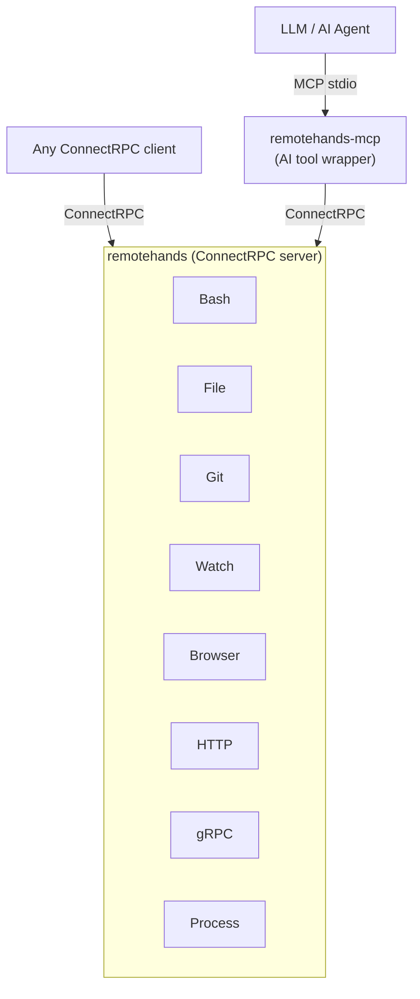

# Remote Hands

A remote execution agent providing bash, filesystem, git, browser automation, HTTP/gRPC, and process management operations via ConnectRPC and MCP.

## What It Does

Remote Hands is a standalone service that exposes a comprehensive set of remote operations:

- **Execution** — Run bash commands with timeout and environment control
- **Filesystem** — Read, write, delete, list, glob, and grep files with path traversal protection
- **Git** — Status, diff, and commit (local operations only)
- **Browser** — Headless Chromium via go-rod: navigate, screenshot, snapshot (DOM + accessibility tree), and execute actions
- **HTTP/gRPC** — Make HTTP requests with persistent cookies and gRPC calls via grpcurl
- **Process Management** — Start, stop, list, and tail long-running background processes
- **File Watching** — Watch files matching glob patterns via fsnotify

## Architecture



## Quick Start

### Build

```bash
go build ./cmd/remotehands
go build ./cmd/remotehands-mcp
```

### Run as ConnectRPC Server

```bash
# Listen on TCP
./remotehands --listen 0.0.0.0:19051 --home /path/to/workdir

# Listen on Unix socket
./remotehands --socket /tmp/remotehands.sock --home /path/to/workdir
```

### Run as MCP Server

```bash
# Connect to a running remotehands server via TCP
./remotehands-mcp --addr localhost:19051

# Connect via Unix socket
./remotehands-mcp --socket /tmp/remotehands.sock
```

## API Overview

| Category | RPCs |
|----------|------|
| **Execution** | `RunBash` (streaming) |
| **Filesystem** | `ReadFile`, `WriteFile`, `DeleteFile`, `ListFiles`, `Glob`, `Grep` |
| **Watch** | `WatchFiles` (streaming) |
| **Git** | `GitStatus`, `GitDiff`, `GitCommit` |
| **Browser** | `BrowserStart`, `BrowserStop`, `BrowserNavigate`, `BrowserListPages`, `BrowserClosePage`, `BrowserScreenshot`, `BrowserSnapshot`, `BrowserAct` |
| **HTTP/gRPC** | `HttpRequest`, `HttpClearCookies`, `GrpcRequest` |
| **Process** | `ProcessStart`, `ProcessStop`, `ProcessList`, `ProcessLogs`, `ProcessTail` (streaming) |

## Proto Definition

The full API is defined in [`proto/remotehands/v1/service.proto`](proto/remotehands/v1/service.proto).

Generated Go code lives in `gen/remotehands/v1/`.

## Prerequisites

- **Go 1.25+**
- **bash** — required for command execution
- **git** — required for git operations
- **chromium** — required for browser automation (headless)
- **grpcurl** — required for gRPC request proxying (optional if not using gRPC features)
- **ripgrep** (`rg`) — optional, used for faster grep with pure-Go fallback

## License

Apache License 2.0 — see [LICENSE](LICENSE) for details.
